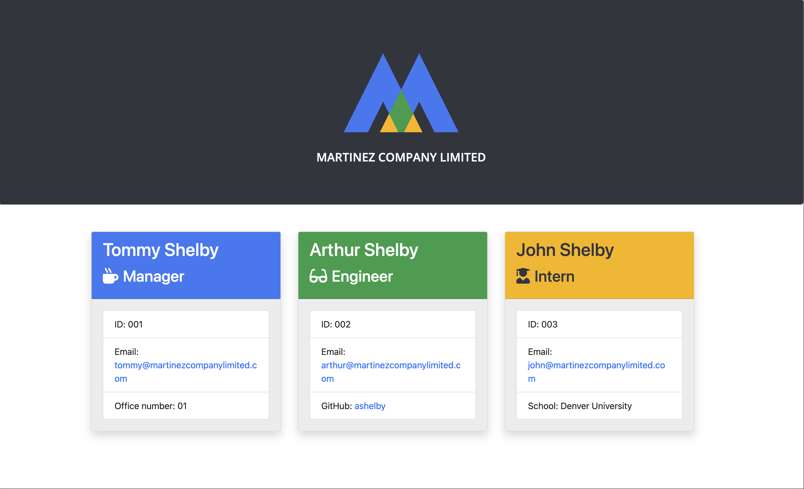

# Team Profile Generator

## Description

One of the most important aspects of programming is writing code that is readable, reliable, and maintainable. This project features a Node CLI application that takes in information about a team of employees and generates an HTML webpage that displays summaries for each member. Technologies used include HTML, Javascript, Bootstrap 4, Node.js, Inquirer.js, and Jest.

## Table of Contents

* [Installation](#installation)
* [Usage](#usage)
* [Contributing](#contributing)
* [Tests](#tests)
* [License](#license)
* [Questions](#questions)

## Installation

* Step 1: Install [Node.js](https://nodejs.org/).
* Step 2: Clone this repository to your local drive.
* Step 3: Open Git Bash (PC) or Terminal (Mac) and navigate to the root directory of this cloned repository.
* Step 4: Enter `npm i` in the command line to install all dependencies detailed in the package.json file.
* Step 5: Enter `node app.js` in the command line to invoke the application.

## Usage

This application uses [Jest](https://www.npmjs.com/package/jest) to test class syntax/constructor functions and [Inquirer.js](https://www.npmjs.com/package/inquirer) to prompt the user with questions that assist in building a team.html webpage featuring each member's information. 

After the prompts are answered by the user, the application automatically generates an HTML page displaying the manager's team.

## Contributing

Please ensure that your pull request adheres to the following guidelines:

* Alphabetize your entry.
* Search previous suggestions before making a new one, as yours may be a duplicate.
* Suggested README's should be beautiful and/or stand out in some way.
* Make an individual pull request for each suggestion.
* New categories, or improvements to the existing categorization are welcome.
* Keep descriptions short and simple, but descriptive.
* Start the description with a capital and end with a full stop/period.
* Check your spelling and grammar.
* Make sure your text editor is set to remove trailing whitespace.
* Use the `#readme` anchor for GitHub READMEs to link them directly

Thank you for your suggestions!

## Tests

This application was created by using class syntax and constructor functions. Each employee type was tested before building out the rest of the application.

## License

This project is MIT licensed.

## Questions

For more information about this application, please feel free to contact me via the links below.

- [Github](https://www.github.com/milehighcoder)
- [Email](mailto:mgmartnz@icloud.com)
